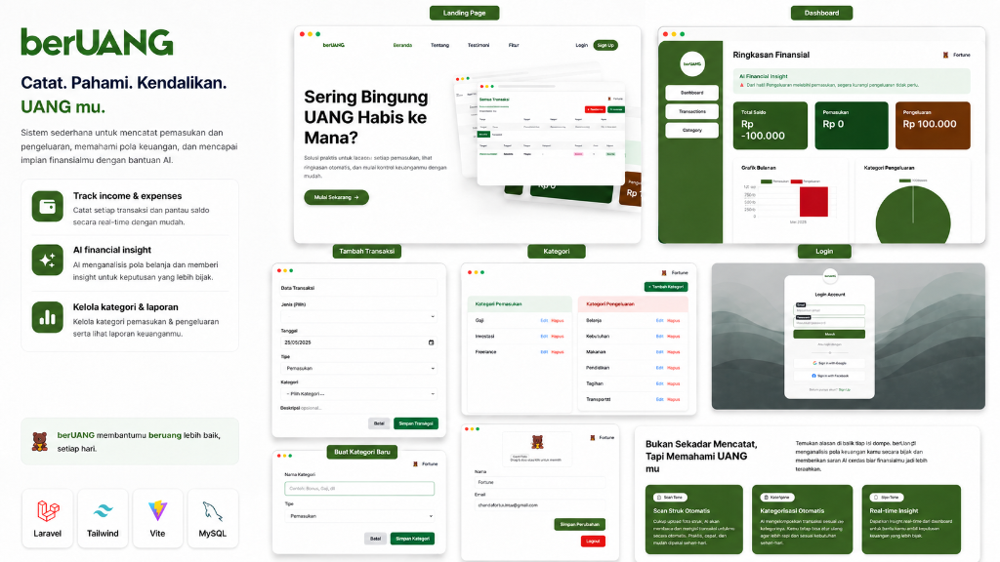
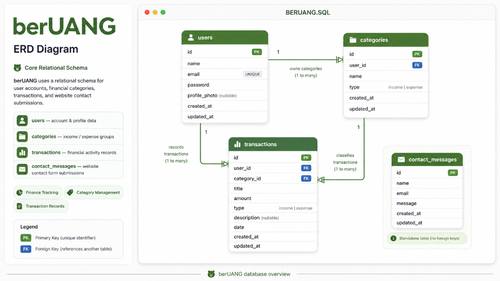

<p align="center">
  
</p>

<h1 align="center">💰 berUANG — Expense Tracking Website</h1>

<p align="center">
  <b>Catat. Pahami. Kendalikan. UANG mu.</b><br/>
  Sistem sederhana untuk mencatat pemasukan dan pengeluaran, memahami pola keuangan, dan mencapai impian finansialmu dengan bantuan AI.
</p>

<p align="center">
  
  
  
  
  
</p>

---

## 📖 About

**berUANG** is a full-stack personal finance tracking web application built with Laravel. It helps users record daily income and expenses, organize transactions by custom categories, visualize spending patterns through interactive charts, and receive AI-powered financial insights — all in a clean, modern Indonesian-language interface.

---

## ✨ Features

### 🏠 Landing Page
- Beautiful, responsive landing page with hero section, feature highlights, testimonials, and a contact form
- Smooth scroll navigation with sticky navbar
- Contact form that sends email notifications to the admin via Gmail SMTP

### 🔐 Authentication
- User registration & login (powered by Laravel Breeze)
- Email verification
- Password reset via email
- Profile management with photo upload
- Account deletion

### 📊 Dashboard
- **Financial Summary** — View total balance, total income, and total expenses at a glance
- **Bar Chart** — Monthly income vs. expense comparison (interactive chart)
- **Pie Chart** — Expense breakdown by category
- **AI Financial Insight** — Smart, logic-based insights that analyze your spending patterns and provide actionable advice (e.g., overspending warnings, savings recommendations)
- **Date Filtering** — Filter dashboard data by custom date range
- **Recent Transactions** — Quick view of the latest 10 transactions

### 💸 Transaction Management
- Create, edit, and delete income/expense transactions
- Assign transactions to custom categories
- Search transactions by title
- Filter by type (income/expense), category, and date range
- Paginated transaction list (15 per page)

### 🏷️ Category Management
- Create custom income and expense categories (e.g., Gaji, Makanan, Transportasi)
- Edit and delete categories
- Protection against deleting categories with existing transactions
- Separate views for income vs. expense categories

### 📄 Report Export
- **Export to PDF** — Download a formatted financial report with transaction details and AI insight
- **Export to CSV** — Download raw transaction data for spreadsheet analysis

### 👤 Profile Management
- Update name, email, and profile photo
- Secure account deletion with password confirmation

### 📧 Contact Form
- Public contact form on the landing page
- Messages are saved to the database and sent to the admin via email

---

## 🗂️ ERD (Entity Relationship Diagram)

<p align="center">
  
</p>

The database consists of **4 main tables**:

| Table | Description |
|---|---|
| `users` | User accounts with name, email, password, and optional profile photo |
| `categories` | Income/expense category groups, owned by each user |
| `transactions` | Financial records linked to a user and a category |
| `contact_messages` | Standalone table for website contact form submissions |

**Relationships:**
- A **User** has many **Categories** (1:N)
- A **User** has many **Transactions** (1:N)
- A **Category** has many **Transactions** (1:N)
- **Contact Messages** is a standalone table (no foreign keys)

---

## 🛠️ Tech Stack

| Layer | Technology |
|---|---|
| **Backend** | Laravel 12 (PHP 8.2+) |
| **Frontend** | Blade Templates, TailwindCSS 3, Alpine.js |
| **Build Tool** | Vite 7 |
| **Database** | MySQL 8 |
| **Authentication** | Laravel Breeze |
| **PDF Export** | Barryvdh DomPDF |
| **Email** | Laravel Mail (SMTP / Gmail) |
| **Dev Tools** | Laravel Pail (logs), Laravel Pint (code style) |

---

## 🚀 Getting Started

### Prerequisites

Make sure you have the following installed on your machine:

- **PHP** ≥ 8.2 — [Download](https://www.php.net/downloads)
- **Composer** — [Download](https://getcomposer.org/download/)
- **Node.js** ≥ 18 & **npm** — [Download](https://nodejs.org/)
- **MySQL** ≥ 8.0 — [Download](https://dev.mysql.com/downloads/)
- **Git** — [Download](https://git-scm.com/downloads)

---

### Step 1 — Clone the Repository

```bash
git clone https://github.com/fortin0o/berUANG-Expense-Tracking-Website.git
cd berUANG-Expense-Tracking-Website
```

---

### Step 2 — Install Dependencies

```bash
# Install PHP dependencies
composer install

# Install Node.js dependencies
npm install
```

---

### Step 3 — Environment Setup

```bash
# Copy the example environment file
cp .env.example .env

# Generate the application key
php artisan key:generate
```

Now open the `.env` file and configure the following:

#### Database Configuration
```env
DB_CONNECTION=mysql
DB_HOST=127.0.0.1
DB_PORT=3306
DB_DATABASE=expense
DB_USERNAME=root
DB_PASSWORD=
```

> **Note:** Create a MySQL database named `expense` before proceeding. You can do this by running:
> ```sql
> CREATE DATABASE expense;
> ```

#### Mail Configuration (Gmail SMTP)
```env
MAIL_MAILER=smtp
MAIL_HOST=smtp.gmail.com
MAIL_PORT=587
MAIL_USERNAME=your-email@gmail.com
MAIL_PASSWORD=your-app-password
MAIL_FROM_ADDRESS="your-email@gmail.com"
MAIL_FROM_NAME="${APP_NAME}"
```

> **Note:** For `MAIL_PASSWORD`, you must use a [Google App Password](https://myaccount.google.com/apppasswords), not your regular Gmail password. Enable 2-Step Verification on your Google account first, then generate an App Password.

---

### Step 4 — Database Migration

```bash
php artisan migrate
```

This will create all necessary tables: `users`, `categories`, `transactions`, `contact_messages`, and Laravel system tables.

---

### Step 5 — Storage Link

```bash
php artisan storage:link
```

This creates a symbolic link from `public/storage` to `storage/app/public`, required for profile photo uploads.

---

### Step 6 — Run the Application

#### Option A: Quick Start (separate terminals)

**Terminal 1** — Laravel backend:
```bash
php artisan serve
```

**Terminal 2** — Vite frontend (for TailwindCSS & hot reload):
```bash
npm run dev
```

#### Option B: All-in-one (recommended)

```bash
composer dev
```

This runs all services concurrently:
- 🟦 **Laravel server** on `http://localhost:8000`
- 🟪 **Queue worker** for background jobs
- 🟥 **Laravel Pail** for real-time log monitoring
- 🟧 **Vite** for frontend asset compilation

---

### Step 7 — Open in Browser

Visit **[http://localhost:8000](http://localhost:8000)** and you're ready to go! 🎉

1. **Sign up** for a new account
2. **Create categories** (e.g., Gaji, Freelance, Makanan, Transportasi)
3. **Add transactions** with dates and amounts
4. **View your dashboard** with charts and AI insights
5. **Export reports** as PDF or CSV

---

## 📁 Project Structure

```
berUANG-Expense-Tracking-Website/
├── app/
│   ├── Http/Controllers/
│   │   ├── AuthController.php          # Login/Register logic
│   │   ├── CategoryController.php      # CRUD for categories
│   │   ├── ContactMessageController.php # Contact form handler
│   │   ├── DashboardController.php     # Dashboard with charts & AI
│   │   ├── ProfileController.php       # Profile management
│   │   └── TransactionController.php   # CRUD + PDF/CSV export
│   ├── Mail/
│   │   └── ContactMessageMail.php      # Contact email mailable
│   └── Models/
│       ├── Category.php
│       ├── ContactMessage.php
│       ├── Transaction.php
│       └── User.php
├── config/
│   └── mail.php                        # Mail driver configuration
├── database/
│   └── migrations/                     # Database schema migrations
├── docs/
│   ├── preview.png                     # App preview screenshot
│   └── erd.png                         # ERD diagram
├── resources/
│   └── views/
│       ├── landing.blade.php           # Landing page
│       ├── dashboard.blade.php         # Dashboard view
│       ├── transactions/               # Transaction CRUD views
│       ├── categories/                 # Category CRUD views
│       ├── profile/                    # Profile management views
│       ├── auth/                       # Login, register, etc.
│       ├── pdf/                        # PDF export templates
│       └── emails/                     # Email templates
├── routes/
│   └── auth.php                        # Authentication routes
├── .env.example                        # Environment template
├── composer.json                       # PHP dependencies
├── package.json                        # Node.js dependencies
└── vite.config.js                      # Vite build config
```

---

## 🧪 Running Tests

```bash
composer test
```

Or directly:
```bash
php artisan test
```

---

## 📝 License

This project is open-sourced software licensed under the [MIT License](https://opensource.org/licenses/MIT).

---

<p align="center">
  Made with ❤️ for better financial awareness<br/>
  <b>berUANG — membantumu beruang lebih baik, setiap hari.</b>
</p>
